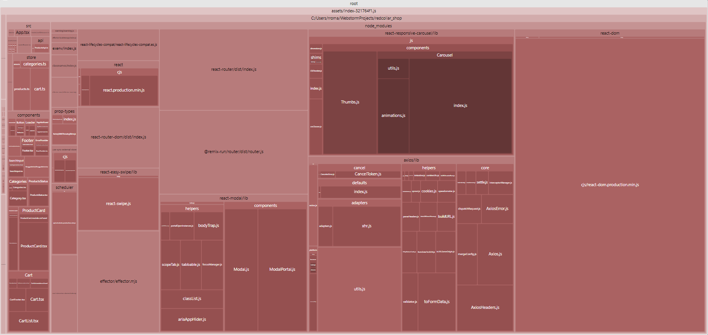
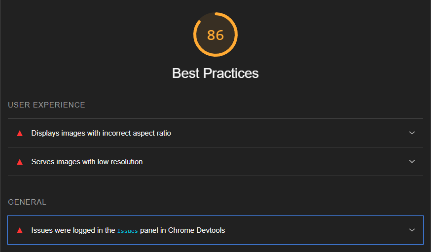

# Второе задание на стажировку [Red Collar](https://redcollar.ru/).

В проекте задействованы следующие технологии:
* **Vite**: в первую очередь взят именно он из-за скорости работы и простоты использования.
* **Typescript**: типизация данных позволяет избежать ошибок еще на этапе разработки (очень помогло работать с параметрами при использовании с **Effector**).
* **React**: после **Node.js** является самой популярной библиотекой/фреймворком для JS, а так же создан Facebook. Из этого вытекает простота долгосрочной поддержки проекта.
* **Effector**: быстрота и мультисторы. Очень гибкий стейт менеджер в работе. Приятно использовать из-за доступности связки множества сторов и евентов между собой. Ну и конечно потому что он наш, отечественный 💪💪💪.
* Различные мелкие пакеты по типу **react-slider** (не будем изобретать велосипед).

# Запуск проекта.

```bash
$ npm install
# dev версия
$ npm run dev
# build версия
$ npm run build
$ npm run preview
```
> ***Внимание!*** В проекте не настроена конфигурация для деплоя. Учитывайте это, если собираетесь запустить сервер удаленно. Рекомендую обратиться к документации [Vite](https://vitejs.dev/guide/static-deploy).

# Краткое описание реализации пунктов из ТЗ.

### 1. Строка поиска

Основная реализация представлена в файле *SearchController.tsx*. 

* Работа с ошибками на уровне всего приложения вынесена в отдельный компонент *ErrorProvider*, к нему в связке идёт необходимость хранения данных "отдельно" от дерева компонентов, здесь в работу вступает **effector** (*error.ts*). В большей степени ошибки отлавливаются с помощью функции **sample** (одно из основных преимуществ эффектора - простота построения связей между компонентами стейт менеджера) на этапе фетчинга данных с сервера.
* Оптимизация поисковых запросов реализована с помощью подхода *debounce search input*. Для этого реализован кастомный хук *useDebounce* с задержкой в полсекунды.
* Очистка по нажатии на "крестик", закрытие строки поиска по повторному нажатии.

### 2. Навигация по категориям

Основная реализация представлена в файлах *Categories.tsx* и *Category.tsx*. 

* Список категорий с фетчингом и ловлей ошибок реализованы с помощью **effector** (categories.ts).
* Было не совсем понятно, нужно ли реализовывать "перетаскиваемый" мышкой список, т.к. упоминания в ТЗ нет, но в кликабельном варианте из фигмы он представлен, однако на всякий случай реализовал подобную логику с помощью компонента *DraggableList*. Из-за особенностей эвентов пришлось так же немного переписать логику клика на категорию: клик отрабатывает только если координаты отпускания мыши не сильно различаются с координатами нажатия.
* Работа со строкой браузера и параметрами реализована с помощью **react-router-dom**.

### 3. Список товаров

Основная реализация представлена в файлах *ProductsGrid.tsx*, *ProductsCard.tsx*, *ProductsStatus.tsx*.

* Пагинация с бесконечной прокруткой реализованны с помощью **react-intersection-observer**. Использовал его из-за маленькой "нагрузки" на итоговый бандл и простоты в использовании. На стороне реакта проверяется сама необходимость загрузки новых данных с сервера. Сами данные (products, skip, limit), а так же функция (эффект), отвечающая за фетчинг, вынесены на сторону эффектора (*products.ts*).
* Прелоадер, а так же статус (ничего не найдено) представлены в *ProductsStatus*, как и логика обсервера для бесконечной прокрутки.
* Т.к. ошибки на уровне проекта выносятся в отдельный стор, использовал на стороне реакта *useEffect* со значением из стора в массиве зависимостей, сохранял ошибку в компоненте и отображал до нажатия на кнопку. Это сделано из-за того что сообщения об ошибках удаляются через несколько секунд после отображения.

### 4. Корзина

Основная реализация в папке Cart. 

* Данные вместе с логикой хранятся на стороне эффектора в файле *cart.ts*. Возможно не лучшее решение, но из-за отсутствия требования в запросах на сервер по айди продукта, решил хранить массив с объектами типа ```[key: productId]: {product: Product, count: number}```, а не просто id каждого продукта с последующим фетчингом. Отдельно от этого массива храню итоговое кол-во и стоимость. Последнее сделано из-за того что эти значения зависят от вложенного значения ```count```. Решил не перебирать сложные объекты при каждом открытии корзины, а хранить два числа сразу. 
* Синхронизация данных реализована с помощью библиотеки **effector-localstorage**. Это "легкая" библиотека, которая позволяет синхронизировать данные с помощью функции *persist*. Вся синхронизация стора занимает 4 строки, это очень удобно.
* Логика добавления, удаления и изменения количества так же реализована на стороне эффектора, на стороне реакта происходит ловля событий от пользователя.

# Итог

1. Получаем после сборки следующее в итоговом бандле:



Результаты: 485KB rendered, 161KB gzip. Единого стандарта для размера бандла нет, однако как было сказано на одной из ваших лекций: *Если размер вашего бандла превышает 600KB, то это повод задуматься*. А потому ситуация удовлетворительная.

### Что можно исправить:

В глаза бросается итоговый вес карусели и модального окна. Это сторонние пакеты, которые используются в программе лишь один раз (карусель - карточка товара, модальное окно - корзина). Так как компоненты сами по себе довольно легко реализуемые, можно создать их самостоятельно с минимальным функционалом. Однако как сказал один мудрец: ***game is game bro, сроки жмут, начальник ругается***. Поэтому спустим с рук эту ситуацию и скажем, что итоговый вес нас устраивает.

2. Итоги lighthouse:


Средний итог - хорошо. Показатель **Best practices** - 85. Картина нормальная, даже хорошая. Однако на деле со стороны фронтенд разработчика она еще лучше, так как показатель в первую очередь режется из-за качества изображений с сервера (в general логи так же от dummyjson):

